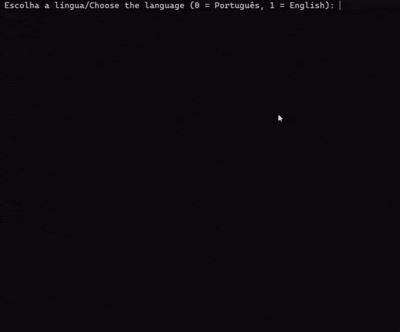

# Xadrez em C / Chess in C

[Versão em português abaixo/ Portuguese version below](#versão-em-português)

---

# English version

This code implements a local two-player chess game, inspired by the official rules of chess.

> I made this game to practice my programming skills. I wanted to make something in C because I had a school subject where I learned about C language, so I also wanted to test my own comprehension of the subject. So, I chose to make a chess game, since it's not a so easy project (because of necessary logic validations, precise rules and etc.), and took the oportunity to bring more resources than the bare minimum (translation, colorful terminal board, and other details).

> **Note**: This is an educational project. Some advanced rules are not yet implemented.

> **Developer's note**: Please be aware that the source code, including all variable names, function names, comments, is written in Portuguese. Some parts of UI are translated via `traducao.c`, but translating everything to English would be dificult to me, since it could bring dificulties to comprehend my own code.

### 🔗 Useful Links

- **Online Demo**: [Test on OnlineGDB (2.1 VERSION - Outdated)](https://onlinegdb.com/RQbpxn_Xr)
- **Repository**: [GitHub - Xadrez-em-C](https://github.com/acms2345/Xadrez-em-C)
- **Pre-compiled Executable**: [releases page](https://github.com/acms2345/Xadrez-em-C/releases)
- **Project architecture**: [architecture.md](https://github.com/acms2345/Xadrez-em-C/blob/main/architecture.md)

## 📋 System Requirements

- **C Compiler**: GCC, Clang, or any standard C compiler
- **Operating System**: Windows, Linux, or macOS
- **Disk Space**: Less than 1 MB

## 🚀 Quick start
The easiest way to get started:
1. Download the latest release from [GitHub Releases](https://github.com/acms2345/Xadrez-em-C/releases)
2. Extract the executable for your OS (Windows/Linux/macOS)
3. Run it directly - no compilation needed!

## How to Install and Use the Source Code

### 1. **Download the Project**

#### Option A: Clone from GitHub
```bash
git clone https://github.com/acms2345/Xadrez-em-C.git
cd Xadrez-em-C
```

#### Option B: Direct download

Access the GitHub repository and click "Code" → "Download ZIP". Then extract the file.

### 2. Compile the project

Open terminal/command prompt in the project folder and run:

```bash
make clean
make
```

### 3. Run the code
Just find the `xadrez.exe` file generated after compilation (it should be in the same folder as the other files). Or you can run:

On Windows:
```powershell
.\xadrez
```
On Linux or macOS:
```bash
./xadrez
```

## How the Code Works


-   **White pieces**: ♙ ♖ ♘ ♗ ♕ ♔ (P, T, C, B, Q, K)
-   **Black pieces**: ♟ ♜ ♞ ♝ ♛ ♚ (p, t, c, b, q, k)

Inside the code, instead of white and black pieces, they are differentiated by uppercase and lowercase characters.

The code also includes a scoring system for each player based on the value of each piece.

## 📁 Project Structure

```text
Xadrez-em-C/
├── Makefile
├── README.md           # You are here!
├── chess-in-c_test.gif           # GIF used in the README
├── architecture.md
├── LICENSE
├── menu.c           # Main menu and entry point 
├── cores.h           # Terminal color definitions (ANSI codes)
├── jogadasvalidas.c / jogadasvalidas.h           # Move validation logic
├── jogo.c / jogo.h           # Main code (interface, game loop)
├── replay.c / replay.h           # Handles game replay
├── traducao.c / traducao.h           # Translation system (i18n)
├── utils.c / utils.h           # Global helper functions.
└── .github/
    └── workflows/
        └── build.yml           # Compile to create Mac, Linux and Windows executables.
```

> **Note**: `salvamento.dat` is generated at runtime when a game is saved; it is not part of the source tree.


## 📊 Scoring System

| Piece      |Symbol   |Value   |
| ---------- |---------|------- |
| Pawn (P/p) |♙ ♟  |1       |
| Knight (C/c) |♘ ♞  |3       |
| Bishop (B/b) |♗ ♝  |3       |
| Rook (T/t) |♖ ♜  |5       |
| Queen (Q/q)  |♕ ♛  |9       |
| King (K/k)   |♔ ♚  |Victory |

> This scoring system does not directly determine the winner. It only gives an idea of which player potentially performed better during the match.

## 🎮 How to Play

1.  The names of the two players are entered into the system.
2.  The board is an 8x8 grid (with the row order being the reverse of conventional chess).
3.  To make a move, the user must enter it in algebraic notation (e.g., e2e4):
    -   First letter: origin column (a-h);
    -   First number: origin row (1-8);
    -   Second letter: destination column (a-h);
    -   Second number: destination row (1-8);
    -   Type "save" to save the game.
    -   Type "resign" to forfeit the game and give victory to your opponent.
    -   Type "draw" to propose a draw to your opponent (the opponent can accept with `y`/`s` or decline with `n`).
4.  The game includes a draw system based on the 50-move rule (100 moves - or half moves - without a capture or pawn move).
5.  The game also detects draws by **threefold repetition** (same position occurring 3 times) and **insufficient mating material** (e.g., King vs King).

- If you wish, in the menu there is a Help option, in which there are some quick instructions about the game.

### Example of a Move



### 💾 About Saving and Loading Games

During the game, when prompted to enter the next move, you can also type "salvar"/"save" to save the current game state to the `salvamento.dat` file.
To resume a saved game, you must choose the "Load Saved Game" option from the main menu.

> The `salvamento.dat` file is binary and should not be edited manually. Only one game can be saved at a time — saving overwrites the previous file.


## ⚠️ Known Limitations

1.  **Single save slot**: Only one game can be saved at a time (`salvamento.dat` is overwritten on each save).
2.  **No network play**: Local two-player only; no AI or online opponent.

## 📄 License

This project is under the MIT License. See the `LICENSE` file for more details.

---

# Versão em português
Tal código corresponde a um jogo de dois jogadores local, inspirado nas regras oficiais do xadrez.

> Criei esse jogo com o intuito de testar minhas habilidades de programação. Tive uma matéria escolar em que conheci a linguagem C, então esse projeto também foi uma forma de testar meu conhecimento acerca da matéria. Assim, escolhi fazer um jogo de xadrez, já que é um projeto de não tanta facilidade (devido a verificações lógicas necessárias, regras precisas e etc.), e aproveitei-o para trazer ainda mais recursos do que o "mínimo" (tradução, tabuleiro colorido em um terminal, e outros detalhes).

> **Nota**: Este é um projeto educacional. Algumas regras avançadas ainda não estão implementadas.


### 🔗 Links úteis

- **Repositório**: [GitHub - Xadrez-em-C](https://github.com/acms2345/Xadrez-em-C)
- **Executável pré-compilado**: [página de releases](https://github.com/acms2345/Xadrez-em-C/releases)
- **Arquitetura do projeto**: [architecture.md](https://github.com/acms2345/Xadrez-em-C/blob/main/architecture.md)
- **Demo Online**: [Testar no OnlineGDB (VERSÃO 2.1 - Desatualizada)](https://onlinegdb.com/RQbpxn_Xr)

## 📋 Requisitos do Sistema

- **Compilador C**: GCC, Clang ou qualquer compilador C padrão
- **Sistema Operacional**: Windows, Linux ou macOS
- **Espaço em disco**: Menos de 1 MB

## 🚀 Instalação rápida
A maneira mais fácil de começar:
1. Baixe a última versão em [GitHub Releases](https://github.com/acms2345/Xadrez-em-C/releases)
2. Extraia o executável para seu sistema operacional (Windows/Linux/macOS)
3. Execute-o diretamente - não é necessário compilar!

## Como Instalar e Usar o Código-Fonte

### 1. **Baixar o Projeto**

#### Opção A: Clonar do GitHub
```bash
git clone https://github.com/acms2345/Xadrez-em-C.git
cd Xadrez-em-C
```
#### Opção B: Download direto
Acesse o repositório no GitHub e clique em "Code" → "Download ZIP". Depois, extraia o arquivo.

### 2. **Compilar o projeto**

Abra o terminal/prompt de comando na pasta do projeto e execute:

```bash
make clean
make
```

### 3. Executar o código
- Apenas é necessário encontrar o arquivo `xadrez.exe` gerado após a compilação (ele deve estar na mesma pasta dos outros arquivos). Ou, você pode abrir o arquivo:
No Windows:
```powershell
.\xadrez
```
No Linux ou MacOS:
```bash
./xadrez
```
## Sobre o funcionamento do código

- **Peças brancas**: ♙ ♖ ♘ ♗ ♕ ♔ (P, T, C, B, Q, K)
- **Peças pretas**: ♟ ♜ ♞ ♝ ♛ ♚ (p, t, c, b, q, k)

Dentro do código, ao invés de peças brancas e pretas, elas são diferenciadas por caracteres maiúsculos e minúsculos.

Por enquanto, o código também conta com um sistema de pontuação para cada jogador com base no valor de cada peça.

## 📁 Estrutura do projeto

```text
Xadrez-em-C/
├── Makefile
├── README.md           # Você está aqui!
├── chess-in-c_test.gif           # GIF usado no README
├── architecture.md
├── LICENSE
├── menu.c           # Menu principal e ponto de entrada
├── cores.h           # Definição de cores para o terminal (códigos ANSI)
├── jogadasvalidas.c / jogadasvalidas.h           # Lógica de validação de movimentos
├── jogo.c / jogo.h           # Código principal (interface, loop do jogo)
├── replay.c / replay.h           # Responsável pelo replay do jogo
├── traducao.c / traducao.h           # Sistema de tradução (i18n).
├── utils.c / utils.h           # Para funções globais auxiliares.
└── .github/
    └── workflows/
        └── build.yml           # Criador dos executáveis para Windows, Linux e Mac.

```

> **Nota**: `salvamento.dat` é gerado em tempo de execução quando uma partida é salva; não faz parte do código-fonte.


## 📊 Sistema de pontuação

| Peça |Símbolos |Valor |
|------|---------|-------|
| Peão (P/p) | ♙ ♟  | 1 |
| Cavalo (C/c) | ♘ ♞  | 3 |
| Bispo (B/b) | ♗ ♝  | 3 |
| Torre (T/t) | ♖ ♜  | 5 |
| Rainha (Q/q) | ♕ ♛  | 9 |
| Rei (K/k) |♔ ♚  | Vitória |

> Esse sistema não influencia diretamente em quem ganha. Eles só dão uma ideia de qual jogador possivelmente se saiu melhor na partida.

## 🎮 Como jogar 

1. O nome dos dois jogadores são informados ao sistema.
2. O tabuleiro funciona com uma tabela de 8 linhas e 8 colunas (com a ordem de linhas sendo o contrário ao convencional do xadrez).
3. Para o usuário mover, é necessário inserir a jogada em notação algébrica (ex: e2e4):
  - Primeira letra: coluna de origem (a-h);
  - Primeiro número: linha de origem (1-8);
  - Segunda letra: coluna de destino (a-h);
  - Segundo número: linha de destino (1-8);
  - Digite "salvar" para salvar o jogo.
  - Digite "desistir" para desistir do jogo e dar a vitória a seu oponente.
  - Digite "empatar" para propor empate ao oponente (o oponente pode aceitar com `y`/`s` ou recusar com `n`).

4. O jogo possui o sistema de empate por 50 lances (100 movimentos - ou seja, meias-jogadas - sem captura ou movimento de peão).
5. O jogo também detecta empate por **repetição tripla** (mesma posição ocorrendo 3 vezes) e por **material insuficiente** (ex: Rei vs Rei).

- Caso você queira, no menu há a opção de Ajuda, na qual há algumas instruções rápidas sobre o jogo.

### Exemplo de jogada


### 💾 Sobre o salvamento e carregamento de partidas

Durante o jogo, quando solicitado para digitar o próximo movimento da peça, você também pode digitar "salvar"/"save" para salvar a partida atual no arquivo `salvamento.dat`.
Para retomar a partida salva, você deve escolher a opção de "Carregar Partida Salva" presente no menu. 
> O arquivo `salvamento.dat` é binário e não deve ser editado manualmente. Apenas uma partida pode ser salva por vez — salvar sobrescreve o arquivo anterior.


## ⚠️ Limitações conhecidas

1. **Apenas um slot de salvamento**: Somente uma partida pode ser salva por vez (`salvamento.dat` é sobrescrito a cada salvamento).
2. **Sem jogo em rede**: Apenas dois jogadores locais; sem IA ou oponente online.

## 📄 Licença

Este projeto está sob a licença MIT. Veja o arquivo `LICENSE` para mais detalhes.
